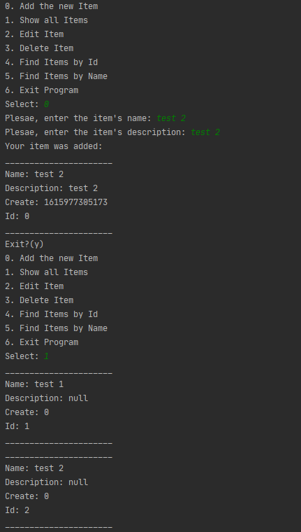

#  Система заявок - трекер

<h1>О проекте</h1>

<h3>Этот проект - консольное приложение. Пользователю отображается меню с возможностями программы.</h3>

**Программа может:**

1. Добавлять заявку.

2. Заменять заявку на новую заявку по ID.

3. Удалять заявку по ID.

4. Отображать список всех заявок.

5. Производить поиск по имени заявки.

